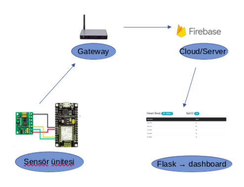
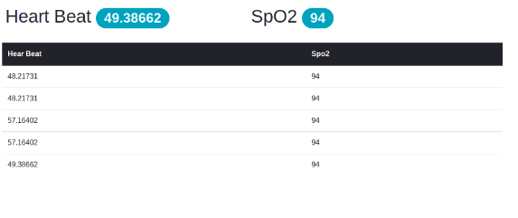

# IOT Project Using Esp8266 and MAX30100

## Used Technologies

- Flask
- MAX30100
- Esp8266
- Firebase Realtime Database

---

This project shows you how to read MAX30100 heart beat sensor, and publish the data to Firebase Realtime Database.
If you want, you can view it on the mini dashboard prepared with flask.

System Architecture :

Flask Dashboard :

